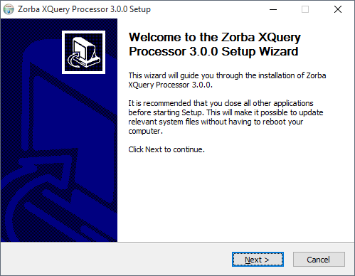
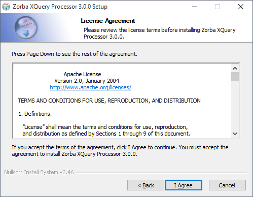
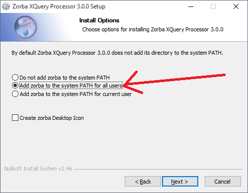
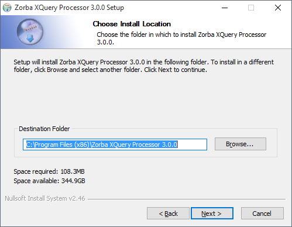
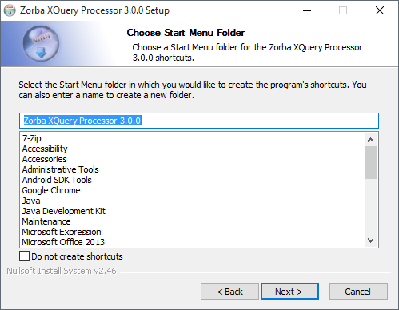
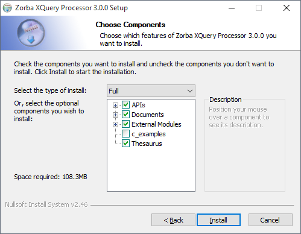

# Step 1 – Install Zorba

After you download the Zorba 3.0 installer, start the installation process by opening the installer file (i.e. double click on it). Click through the installation screens, using the settings shown in the screenshots below:













You can test the Zorba installation by opening up a Windows command prompt and entering the following command:

```jsoniq
zorba -q 1+1
```

If Zorba is correctly installed, running this command should return the following output:

```xml
<?xml version="1.0" encoding="UTF-8"?>
2
```