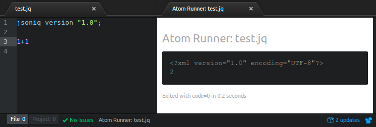

# Step 5 – Test and Finish

Congratulations, you should now have a fully functional JSONiq development environment installed on your local machine. Try testing out your new environment by opening up Atom and creating a new JSONiq file with a ".jq" extension. Try entering the following JSONiq code:

```jsoniq
jsoniq version "1.0";
1 + 1
```

Press `ALT+R` to execute the query. A new Atom Runner tab should open with the query results, as shown below:

